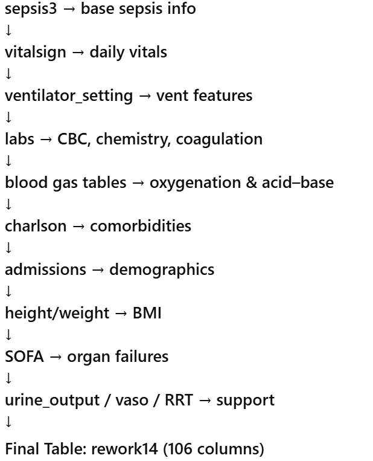

===============================================================================
===== FILE: docs/merging_overview.md
===============================================================================

# Merging Overview — Creation of Final Dataset (rework14)

The dataset `rework14` is the culmination of merging **17+ MIMIC-IV tables**
into a unified daily-resolution ICU dataset.

---

# 1. Tables Used

- vitalsign  
- ventilator_setting  
- labs (CBC, chemistry, coagulation)  
- blood gas (bg, bg_mapped)  
- urine_output  
- charlson  
- admissions  
- icustays  
- derived.age  
- derived.height  
- first_day_weight  
- sepsis3  
- vasopressor medication tables  
- RRT (meld)  
- organ failure indicators  

---

# 2. Merge Logic

### Daily Alignment  
All timestamped data were converted to daily aggregates → `stay_id × chart_date`.

### ICU Alignment  
Everything merges on `stay_id`.

### Hospital → ICU Mapping  
`(subject_id, hadm_id)` joined via `icustays`.

### Iterative Construction  
The dataset was built through incremental steps:

1. Sepsis anchor + vitals  
2. Add ventilator metrics  
3. Add labs  
4. Add blood gas  
5. Add comorbidities  
6. Add demographics  
7. Add height / weight / BMI  
8. Add SOFA organ flags  
9. Add urine output + RRT + vasopressors  
10. Clean + finalize → **rework14**

---

# 3. Pipeline Diagram (ASCII)

# 4. Purpose

`rework14` is the unified feature dataset used to build:

- SIC labels  
- ISTH DIC labels  
- JAAM DIC labels  
- Next-day deterioration prediction models  

It contains all physiology, labs, comorbidity, demographic, and support-therapy
variables required for sepsis → SIC → DIC modeling.

